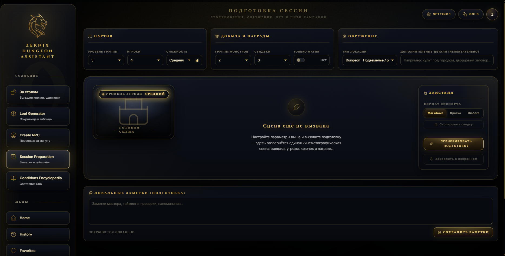
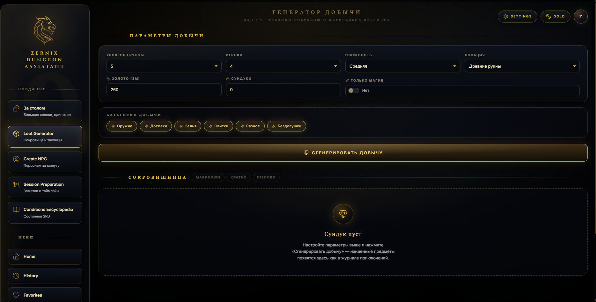
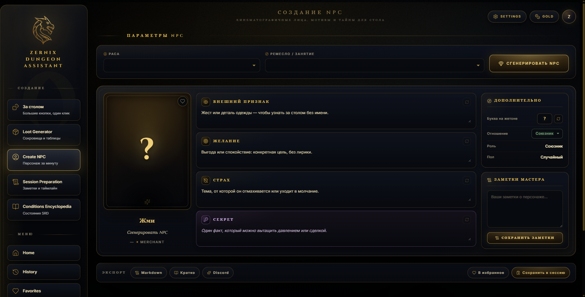
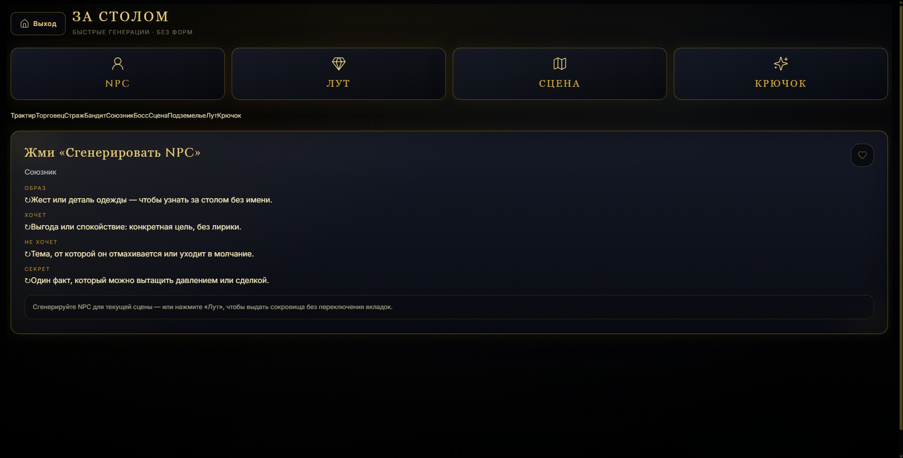

# ZERNIX Dungeon Assistant

> Публичный портфолио-срез продукта ZERNIX. Активная разработка ведётся в закрытом репозитории, актуальное веб-приложение доступно на **[zernix.ru](https://zernix.ru)**.

ZERNIX Dungeon Assistant — продуктовый инструмент для мастеров настольных ролевых игр с фокусом на **D&D 2024**. Он сокращает путь от черновой идеи до материала, который можно использовать за игровым столом:

`идея → сцена → NPC → encounter → loot → игровая сессия`

Этот репозиторий сохраняет раннюю web/Electron-реализацию как инженерный case study. Он не является источником актуальной production-версии.

## Возможности публичной версии

- Подготовка сессий и переиспользуемых session briefs
- Генерация NPC с мотивацией, секретом и нарративными деталями
- Подготовка encounters с учётом группы и окружения
- Генерация loot с ограничениями редкости и стоимости
- Справочник состояний для использования за игровым столом
- История и избранное для сгенерированного контента
- Сфокусированный режим Active Table
- Локальное хранение данных и desktop-сборка

В закрытом продуктовом репозитории продолжается работа над контекстом кампании, данными мира, локациями, фракциями и production-сервисами. Возможности в разработке намеренно не описываются здесь как завершённые.

## Интерфейс

| Подготовка сессии | Генерация loot |
| --- | --- |
|  |  |

| Создание NPC | Режим Active Table |
| --- | --- |
|  |  |

## Инженерные решения

- React/TypeScript-интерфейс, разделённый на продуктовые представления и доменные модели
- Отдельные bridges для генерации сессий, NPC и loot
- SQLite-данные в desktop-версии и интеграция через Electron IPC
- Локальный REST API с проверкой API-ключа для операций генераторов
- Smoke-скрипты, проверяющие пустые значения, дубли, диапазоны и согласованность текста
- Portable- и installer-сборки Windows через Electron Builder
- Локальное хранение истории, избранного и пользовательских настроек

## Архитектура

```text
React views и contexts
        │
        ├── Доменная логика Session / NPC / Loot
        ├── Пользовательские данные и контент-каталоги
        │
Electron shell
        ├── IPC handlers
        ├── Локальный REST API с аутентификацией
        └── SQLite-ресурсы и packaging
```

UI, генераторы, desktop-интеграция и доступ к данным находятся в отдельных модулях. Это позволяет развивать web- и desktop-поставку без концентрации всей логики в application shell.

## Стек

- React 18, TypeScript, Vite
- Tailwind CSS и компонентные CSS-стили
- Node.js и Express
- Electron и Electron Builder
- SQLite / better-sqlite3
- LocalStorage для пользовательских данных клиента

В актуальной закрытой версии также используется production-инфраструктура на базе Docker, Linux, nginx и VPS.

## Локальный запуск публичной версии

Потребуются актуальная LTS-версия Node.js и npm.

```bash
npm ci
npm run dev
```

Production-сборка:

```bash
npm run build
```

Electron-версия:

```bash
npm run electron
```

Часть desktop-ресурсов базы данных намеренно не включена в публичный срез. Доступные сценарии сборки и проверки перечислены в `package.json` и `scripts/`.

## Структура репозитория

```text
src/                 React-приложение и продуктовые представления
src/zernix/          Доменные модели, генераторы и отображение данных
electron/            Desktop shell, IPC, локальный API и SQLite
scripts/             Сборка, packaging, integrity- и smoke-проверки
database/            Реляционная модель и справочные SQL-запросы
docs/                Продуктовые и технические материалы
archive/             Сохранённый legacy UI, не подключённый к приложению
```

## Статус

- **Работающий продукт:** [zernix.ru](https://zernix.ru)
- **Публичный репозиторий:** портфолио-срез
- **Активная разработка:** закрытый репозиторий

Публичный код позволяет оценить раннюю архитектуру и развитие продукта. Production-конфигурация, credentials, развёртывание и текущая продуктовая работа остаются закрытыми.
