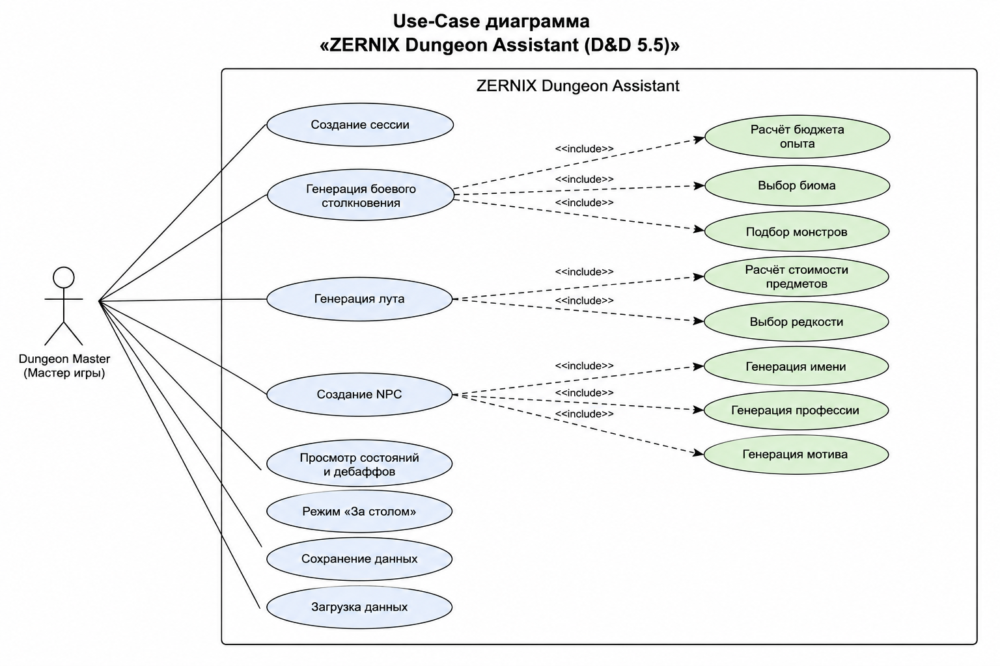
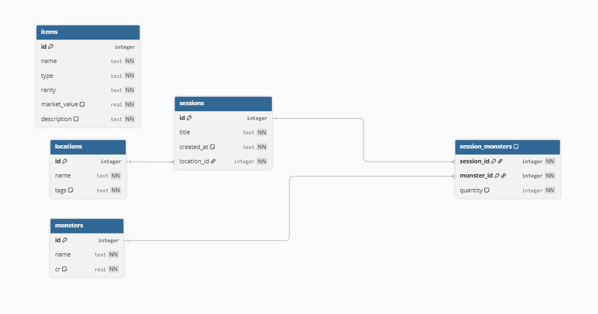

# Учебная практика УП.02 «Разработка программных модулей»

**Выполнил:** Студент 3 курса группы 01-23. ИСИП. ОД.9 «Хекслет Колледж» Шестернин Никита  
**Специальность:** 09.02.07 Информационные системы и программирование  
**Руководитель практики:** Сизов С. Е.  
**Тема проекта:** Кроссплатформенное MVP-приложение «ZERNIX Dungeon Assistant» (D&D 5.5)  

---

# Задание 1. Описание тематики дипломного проекта

## 1. Актуальность темы

В период с 2024 по 2026 годы компания Wizards of the Coast выпустила обновлённую редакцию правил настольной ролевой игры Dungeons & Dragons (D&D 5.5 / Core Rulebooks 2024). Новая версия существенно изменила механики расчёта боевых столкновений, генерации предметов, баланса монстров и игровых состояний.

Большинство существующих цифровых инструментов для D&D ориентированы на правила редакции 2014 года, требуют постоянного подключения к интернету и используют перегруженный интерфейс. Во время игровой сессии это замедляет работу мастера игры и усложняет подготовку сцен, NPC и боевых столкновений.

Проект «ZERNIX Dungeon Assistant» направлен на создание автономного (offline-first) приложения с быстрым и минималистичным интерфейсом, полностью адаптированного под механики D&D 5.5. Использование локального хранения данных и SPA-архитектуры позволяет сократить время подготовки игровых сцен и автоматизировать рутинные процессы мастера игры.

---

## 2. Целевая аудитория

Приложение ориентировано на две основные категории пользователей:

### Начинающие Dungeon Masters
Пользователи, которым требуется помощь при расчёте бюджета опыта, подборе монстров, генерации NPC и распределении лута.

### Опытные мастера кампаний
Пользователи, которым важны скорость работы интерфейса, автономность приложения и возможность быстро генерировать игровые элементы во время живой сессии.

---

## 3. Предполагаемые функциональные возможности (MVP)

Приложение представляет собой SPA-систему с несколькими основными модулями:

### Session Prep (Home)
Создание и настройка текущей игровой сессии.

### Encounter Generator (Prep)
Автоматический расчёт бюджета опыта, выбор биома и подбор монстров для боевого столкновения.

### Loot Generator
Генерация сокровищ и магических предметов с автоматическим расчётом стоимости и редкости.

### NPC Creator
Создание карточек NPC с генерацией имени, профессии и скрытого мотива персонажа.

### Conditions Reference
Интерактивный справочник игровых состояний, дебаффов и статусов.

### Active Table Mode
Режим блокировки интерфейса (оверлей под иконкой замка) для фокусировки на текущем игровом процессе.

### Local Data Management (Settings / History)
Сохранение, загрузка и ведение истории пользовательских данных без подключения к интернету.

---

## 4. Используемые технологии

* **React 18** — построение SPA-интерфейса (функциональные компоненты, хуки);
* **TypeScript** — строгая типизация данных, интерфейсов монстров и предметов;
* **Tailwind CSS** — адаптивная верстка интерфейса в минималистичном темном стиле;
* **Vite** — сборка проекта;
* **Electron** — создание десктопной версии приложения в автономный (.exe) файл;
* **SQLite / LocalStorage** — локальное хранение данных для обеспечения offline-first подхода.

---

## 5. Ожидаемый результат

Результатом работы станет MVP-приложение «ZERNIX Dungeon Assistant», работающее в двух режимах:
1. Веб-приложение (SPA), опубликованное через GitHub Pages;
2. Десктопное приложение для Windows на базе Electron.

Приложение позволит автоматизировать подготовку игровых сессий D&D 5.5, генерацию NPC, боевых столкновений и игрового лута без необходимости подключения к интернету.

---

# Задание 2. Создание Use-Case диаграммы

На основе функциональных требований MVP была разработана UML Use-Case диаграмма, отражающая взаимодействие пользователя с системой и внутренними модулями приложения.

## Диаграмма вариантов использования



## Основные элементы диаграммы

### Актор
* **Dungeon Master (Мастер игры)** — основной пользователь системы, управляющий ходом сессии.

### Основные прецеденты использования
* Создание сессии;
* Генерация боевого столкновения;
* Генерация лута;
* Создание NPC;
* Просмотр состояний и дебаффов;
* Режим «За столом»;
* Сохранение данных;
* Загрузка данных.

### Связи include
Прецеденты содержат вложенные процессы:
* **Генерация столкновения включает:**
  * расчёт бюджета опыта;
  * выбор биома;
  * подбор монстров.
* **Генерация лута включает:**
  * расчёт стоимости предметов;
  * выбор редкости.
* **Создание NPC включает:**
  * генерацию имени;
  * генерацию профессии;
  * генерацию мотива.

---

# Задание 3. Проектирование и начальная разработка интерфейса

В рамках практической части было реализовано MVP-приложение с использованием React 18, TypeScript и Tailwind CSS.

---

## 1. Архитектура интерфейса

Интерфейс приложения разделён на несколько основных экранов:
* **Session Prep (Home / Prep)** — главная панель подготовки;
* **Loot Generator** — модуль генерации сокровищ;
* **NPC Creator** — конструктор персонажей с выводом графических токенов пола (♂ / ♀);
* **Conditions** — справочник игровых статусов;
* **Active Table Mode** — интерфейс фокусировки мастера.

Переключение между разделами выполняется без перезагрузки страницы через управление состоянием React (Tab switching), что обеспечивает минимальную задержку отклика интерфейса.

HTML-разметка построена с использованием семантических тегов:
* `<main>` — основная рабочая область;
* `<section>` — логические блоки генераторов;
* `<nav>` — навигационные элементы;
* `<aside>` — боковая панель меню.

---

## 2. Реализованная клиентская логика

### Управление состоянием
Реализовано переключение вкладок бокового меню и динамическое обновление контента в главном окне.

### Обработка данных
Добавлена базовая обработка и валидация пользовательских параметров:
* ввод числовых значений (бюджеты опыта, калькуляция монет);
* выбор биомов из выпадающих списков;
* переключение интерактивных режимов интерфейса.

### Генерация данных
Реализована:
* генерация случайных NPC (имя, роль, мотив);
* генерация предметов и лута;
* автоматический вывод стоимости сокровищ в золотых монетах (зм);
* отображение игровых параметров и дебаффов.

### Active Table Overlay
Добавлен режим блокировки интерфейса (экранный оверлей под значком замка) для фиксации внимания на текущем раунде боя во время живой игры.

---

## 3. Скриншоты интерфейса

### Экран 1 — Панель управления (Session Prep / Home)


### Экран 2 — Модуль сокровищ (Loot Generator)


### Экран 3 — Конструктор персонажей (NPC Creator)


### Экран 4 — Режим фокуса (Active Table Mode)


---

# Архитектура проекта

## Иерархия файлов корневого каталога

```bash
ZERNIX Dungeon Assistant/
│
├── index.html                 # HTML-точка входа Vite
├── package.json               # Зависимости и npm-скрипты
├── vite.config.ts             # Сборка SPA (base: './' для GitHub Pages)
├── tsconfig.json              # TypeScript
├── tailwind.config.js         # Tailwind CSS
├── postcss.config.js
├── electron-builder.client.yml # Конфиг упаковки Electron
├── README.md                  # Отчёт по учебной практике (УП.02)
│
├── npc-engine.mjs             # Node-движок генерации NPC (Electron)
├── npc-data-expansion.mjs     # Расширенные данные NPC
│
├── src/                       # Основной фронтенд (React)
├── electron/                  # Main-процесс Electron
├── public/                    # Статика для dev/build
├── scripts/                   # Сборка, smoke-тесты, патчи
├── docs/                      # Документация и SRD-справочники
├── assets/                    # Скриншоты и материалы для отчёта
├── archive/                   # Старый UI (не подключён)
│
├── tools/                     # SQLite-движок лута/сессий (локально, в .gitignore)
├── dist/                      # Production-сборка (после npm run build)
└── dist_electron/             # Portable/установщик Windows (после npm run dist)
```

---

# Задание 4. Проектирование базы данных

**Выполнил:** Студент 3 курса группы 01-23. ИСИП. ОД.9 «Хекслет Колледж» Шестернин Никита  
**Специальность:** 09.02.07 Информационные системы и программирование  
**Руководитель практики:** Сизов С. Е.  
**Тема проекта:** База данных для MVP-приложения «ZERNIX Dungeon Assistant» (D&D 5.5)

---

В рамках модуля спроектирована реляционная модель данных для обеспечения целостности и эффективного управления игровыми объектами.



| Таблица | Описание | Основные поля |
| :--- | :--- | :--- |
| `locations` | Справочник игровых локаций | `id`, `name`, `tags` |
| `items` | Каталог предметов | `id`, `name`, `type`, `rarity`, `market_value` |
| `monsters` | Бестиарий | `id`, `name`, `cr` |
| `sessions` | Лог игровых сессий | `id`, `title`, `location_id` |
| `session_monsters` | Связь сессий и монстров (M:N) | `session_id`, `monster_id`, `quantity` |

* **Связи:** Реализованы `1:M` (Локации ↔ Сессии) и `M:N` (Сессии ↔ Монстры) через промежуточную таблицу.
* **Целостность:** Использованы внешние ключи (`FOREIGN KEY`) с правилами `ON DELETE CASCADE` и `ON UPDATE CASCADE`.

---

База данных реализована посредством SQL-скриптов, обеспечивающих создание структуры и инициализацию данных.

* **Скрипт структуры:** [database/init_db.sql](./database/init_db.sql)
* **Тестовые данные:** Скрипт содержит `INSERT` запросы для всех таблиц, что позволяет мгновенно развернуть БД.

---

Для работы с данными подготовлен набор из 5 целевых запросов:

1. **Фильтрация (SELECT/WHERE):** Поиск предметов по редкости.
2. **Добавление (INSERT):** Регистрация нового монстра.
3. **Обновление (UPDATE):** Корректировка цен предметов.
4. **Удаление (DELETE):** Очистка истории сессий.
5. **Аналитика (JOIN/SUM):** Расчет суммарного рейтинга сложности (CR) монстров в сессии.

* **Файл запросов:** [database/queries.sql](./database/queries.sql).